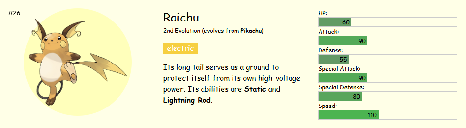
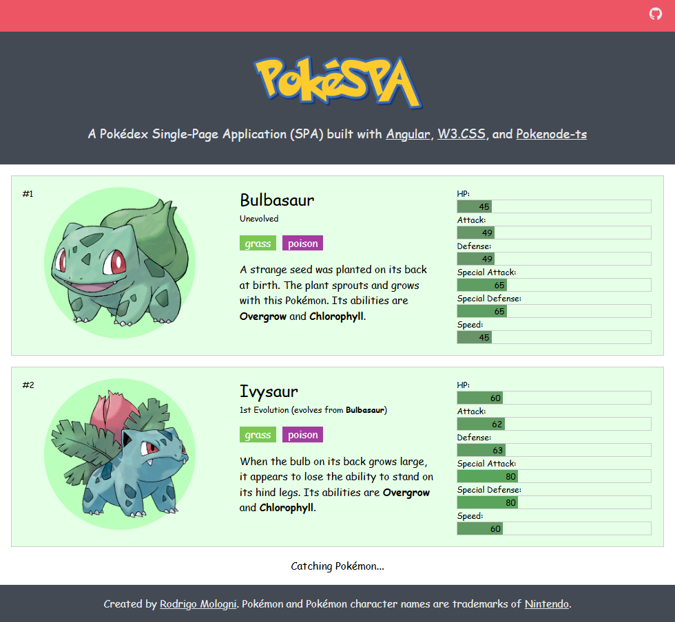

<br />
<div align="center"></div>
<br />

**PokéPWA** is an educational project featuring a Pokédex Progressive Web App (PWA).
It leverages [**Angular**](https://angular.dev/) for a reactive UI, [**W3.CSS**](https://www.w3schools.com/w3css/) for lightweight styling, and [**Pokenode-ts**](https://pokenode-ts.vercel.app/) for seamless [PokeAPI](https://pokeapi.co/) integration.

## 🐸 For Pokémon Trainers

This Pokédex offers comprehensive data on over 1,000 species, featuring:

- **Visual Identity:** official artwork and a background color reflecting the Pokémon's body color.
- **Core Data:** National Pokédex ID and official name.
- **Combat Intel:** primary types, available moves, and abilities.
- **Evolutionary Lines:** current evolution stage and the name of its previous form.
- **Lore & Stats:** classic favor text and base stats (HP, Attack, Defense etc.).

<div align="center"></div>

## 👨‍💻 For Development Students

If you wish to run or study the source code of this application, follow the steps below.

### 🛠️ Prerequisites

Ensure you have the following installed:

- [**Git**](https://git-scm.com/install/)
- [**Node.js**](https://nodejs.org/download/) (LTS version recommended)
- [**Angular CLI**](https://angular.dev/tools/cli)

### 🚀️ Installation and Execution

1. Clone the repository:

```bash
git clone https://github.com/rodrigomologni/pokepwa.git
cd pokepwa
```

2. Install dependencies:

```bash
npm install
```

3. Start the development server:

```bash
npm start
```

The application will be available at [http://localhost:4200/](http://localhost:4200/), as shown below.

<div align="center"></div>
